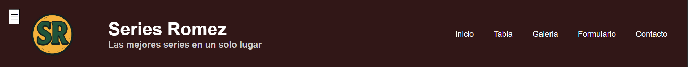
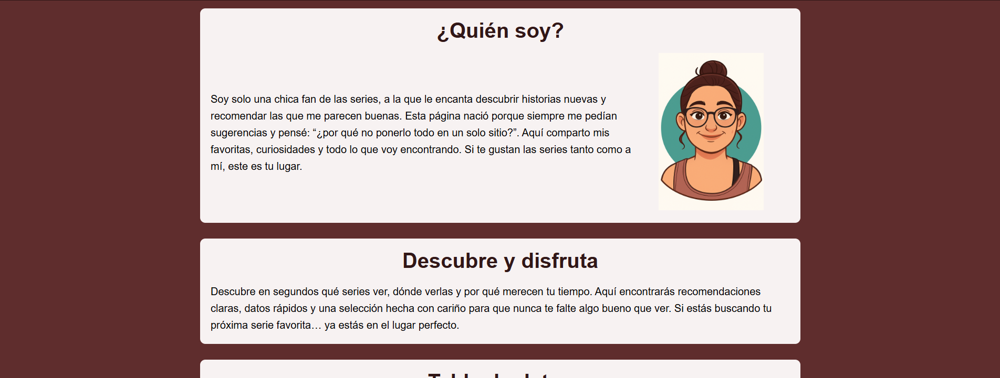
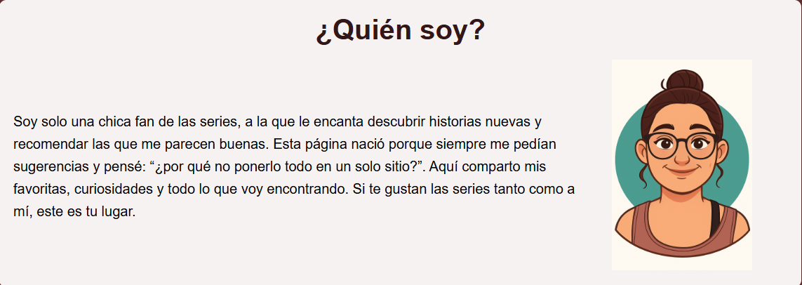
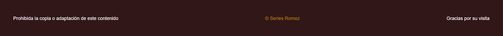
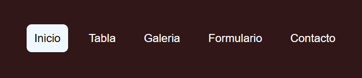
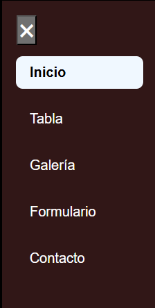
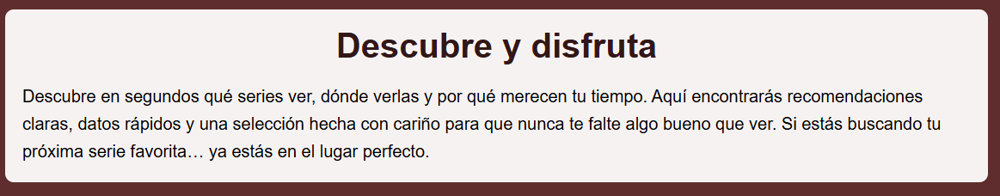
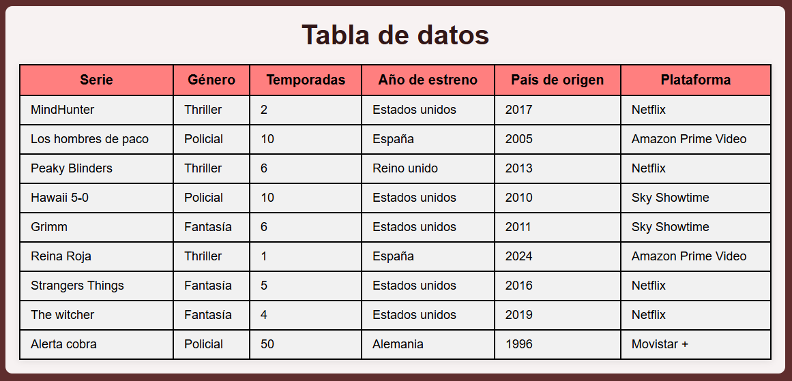
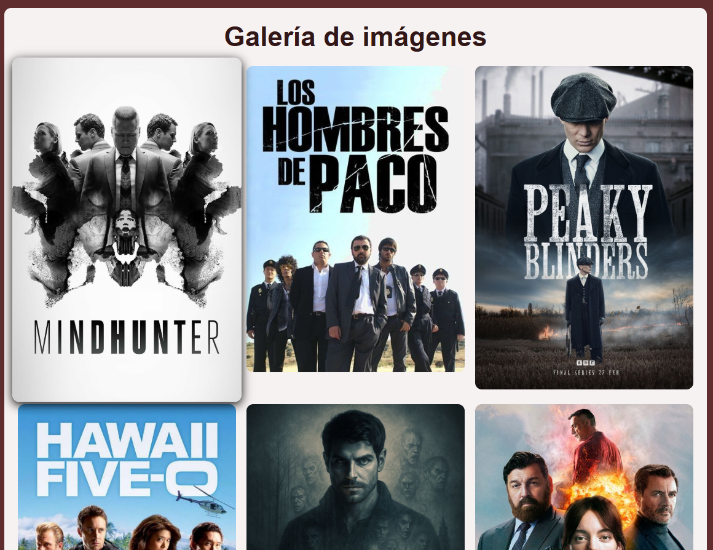
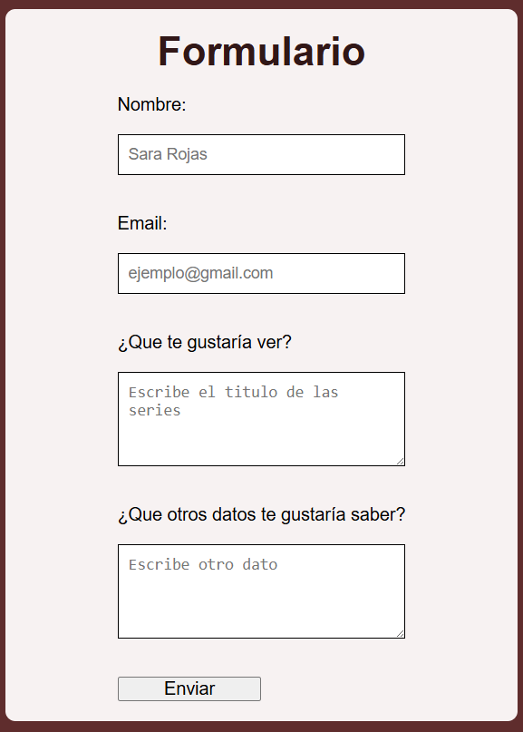

# Examen-lenguaje-RA2

## 1A. Pregunta

En el .site-header el atributo align-items: center, choca con el justify-content: space-between. Lo que está pasando es que align-items alinea al centro solo si queda espacio libre, al usar space-between no queda espacio libre para poder centrarlo.

## 1B. Solucion

Usando flexbox se soluciona si usas *space-around*

**Flexbox**

```css
.site-header {
  display: flex;
  justify-content: space-around;
  align-items: center;
}
    
h1 {
  text-align: center;
}
```

**Grid**


## 1C. Convertir cabecera

Se consigue con el *flex-direction: column;* que lo agrupa de forma vertical

```css
.site-header {
  display: flex;
  justify-content: space-between;
  align-items: center;
  flex-direction: column;
}
  
h1 {
  text-align: center;
  margin-bottom: 30px;
}
```

## 1D. Estilo del header

```css
.site-header {
  display: flex;
  justify-content: space-between;
  align-items: center;
  flex-direction: column;
  /*Le añado las siguientes reglas*/
  background-color: antiquewhite; /*Fondo*/
  padding: 20px; /*Espaciado interior*/
  border-bottom: 3px solid black; /*Separacion visual*/
}
    
h1 {
  text-align: center;
  margin-bottom: 30px;
}
```

---

## 2A. Boton en el header

```html
<header class="site-header">
  <button class="open-menu" aria-label="Abrir menú lateral">☰</button>

  <h1>Mi Sitio Web</h1>

  <nav class="main-nav">
    <li>Menu</li>
  </nav>
</header>
```

## 2B. CSS nuevo

Al incluir la linea de codigo correspondiente al botón del menú lateral como la primera linea del header antes de lo demás, no es necesario cambiar el css del ejercicio 1D, porque ya se agrupa sólo tal y como se pide.

```css
.site-header {
  display: flex;
  justify-content: space-around;
  align-items: center;
  background-color: antiquewhite;
  padding: 20px;
  border-bottom: 3px solid black;
}
        
h1 {
  text-align: center;
  margin-bottom: 30px;
}
```

---

## 3A. Miniaturas

No he podido crear las miniaturas en sí, pero lo he simulado manipulando el width de las imagenes.

## 3B. Efecto hover

Yo ya tenia esto realizado en mi página. Lo hice porque me parecía guay el efecto del zoom. Investigando diferentes transiciones encontre esta línea de código y la apliqué a mi proyecto.

## 3C. Enlace a imagen

**HTML corregido**

He añadido las etiquetas *a* con el enlace a la imagen original para que al pinchar te lleve a la imagen en grande. El atributo *target:"_blank"* hace que se abra en otra pestaña.

```html
<section id="galeria">
  <h2>Galería de imágenes</h2>
    <div class="galeria-grid">
      <a href="img/img-1.jpeg" target="_blank"></a>
      <a href="img/img-2.jpeg" target="_blank"></a>
      <a href="img/img-3.jpeg" target="_blank"></a>
      <a href="img/img-4.jpeg" target="_blank"></a>
      <a href="img/img-5.jpeg" target="_blank"></a>
      <a href="img/img-6.jpeg" target="_blank"></a>
      <a href="img/img-7.jpeg" target="_blank"></a>
      <a href="img/img-8.jpeg" target="_blank"></a>
      <a href="img/img-9.jpeg" target="_blank"></a>
    </div>
</section>
```

**CSS zoom + sombra**

La línea *transform: scale(1.05);* provoca el zoom en la imagen y la linea *box-shadow: 0 4px 15px rgba(0,0,0,1);* provoca la pequeña sombra destrás de la imagen, todo esto solo cuando pasa el ratón por encima gracias al *:hover*.

```css
.galeria-grid img:hover {
  transform: scale(1.05);
  box-shadow: 0 4px 15px rgba(0,0,0,1);
}
```

---

## 4. Informe de evidencias

### 4.1 Introducción

Quería hacer una web que reflejara algo que me gustara mucho, algo que se me ocurrió que entra en la lista de cosas que me gustan son las series, de diferentes estilos, más nuevas, más antiguas... Precisamente eso es lo que contiene mi proyecto. 

En la página he incluido una sección que habla sobre mí, la sección hero: que te da un adelanto de lo que encontrarás, una tabla donde recojo diferentes series con sus datos más relevantes como: el género al que pertenecen, el número de temporadas, el país de origen, el año de estreno y la plataforma donde actualmente están disponibles.También he incluido una pequeña galería de imagenes, un formulario para posibles sugerencias y un apartado de contacto. 

Mi idea original era algo más elaborada, ya que quería hacer una web donde pudieras consultar la informacion, principal o secundaria, de cualquier serie pero como me iba a llevar más tiempo del dado tuve que adaptarme. Aún así quiero actualizar la página para llevar a cabo la idea original. 

### 4.2 HTML

**1. Partes principales**

  - **Header**: es la parte principal de la página, con sus diferentes funcionalidades, lo que le da al usuario la información necesaria que debe saber sobre la página que está visitando, como: el nombre, el eslogan, que secciones tiene y el logo.


    
  - **Main**: esto constituye todo el cuerpo de la página, sin contar el header ni el footer. Aquí están todas las secciones.


    
  - **Section**: es un fragmento de la página con su correspondiente información y su correspondiente estilo. Puede ser un estilo único o repetirse.



  - **Footer**: se puede decir que es la despedida hacia el usuario, ya que lo ve cuando llega al final de la página. Se usa para poner información que no es del todo relevante para el usuario pero que no importa que sepa, por ejemplo un mensaje de copyRight.



**2. Menús**

  - **Menú superior**: es algo muy común en las páginas web, ya que hace la navegación mucho más fácil. El usuario puede entrar en la página y solo con ver el menú se puede hacer una idea de lo que esta contiene. Por otra parte, las opciones del menú por norma general tiene enlaces internos a la seccion que le corresponda, de nuevo para hacer la navegación del usuario más cómoda.
    


  - **Menú lateral**: es un menú igual al menú superior pero con la diferencia de que puedes acceder a él sin importar la zona de la página en la que estes, es decir, si estás ya cerca del final y quieres ver lo que estaba escrito en unas de las secciones del principio de la página solo tienes que abrir el menu lateral y hacer click en la opción que quieras. Hace mucho más cómoda la navegación del usuario.



**3. Secciones**

  - **Sección Hero**: el objetivo de esta sección es captar la atención del usuario, darle un resumen de lo que se va a encontrar si sigue bajando y conseguir que se quede en la página. Normalmente son secciones atractivas para el ojo humano y directas.



  - **Tabla de datos**: se compone de diferentes datos principales de las series que se ofrecen, de modo que el usuario sepa de manera rápida, fácil y resumida de qué se está hablando.  



  - **Galería**: su objetivo es enseñarle al usuario el producto de una forma más visual, de forma que se quede mejor con la información que tu le estas ofreciendo. Por otro lado, para hacerlo más entrenido y atractivo para el usuario, puedes introducir algun efecto cuando se interactúe con las imágenes como que aparezca una sombra de detrás o una transicion como es el zoom para que se amplie un poco la imagen.



  - **Formulario**: esta parte de la página se hace para hacer participe al usuario sobre la información que verá en un futuro y que así se sienta parte de ello. Le puedes pedir su nombre, su email y luego algo cómo sugerencias para seguir ampliando la página con contenido que sabes que va a gustar. De esta manera el usuario siente que su opinión cuenta.



**4. Enlaces**

  - **Internos**: este tipo de enlace se pone para hacerle la vida más fácil al usuario mientras esté visitando tu página. Por ejemplo, puedes poner enlances en las opciones del menú como ya he mencionado antes o también puedes poner un enlance al final de la página para poder subir al inicio de esta simplemente haciendo click. De nuevo es hacerle la navegación más fácil al usuario.


### 4.3 CSS

Con este diseño quería conseguir un estilo de página tranquilo y simple, pero bonito y en el que todo encajara bien, donde todos los elementos tuvieran su hueco en la página sin desentonar con los demás.

**1. Selectores**

  - **Selector de tipo**: se aplica a todos los elementos que pertenezcan a esa etiqueta. 

```css
body {
  margin: 0;
  padding: 0;
  box-sizing: border-box;
  font-family: Arial, Helvetica, sans-serif;
}
```

  - **Selector de clase**: solo se aplica a los elementos que esten dentro de cualquier etiqueta que tenga como atributo la clase elegida.
    
```css
.cabecera {
  display: flex;
  align-items: center;
  justify-content: space-between;
  padding: 20px 40px;
  background: #311717;
  color: white;
}
```

  - **Selector de id**: solo se aplica a los elementos que estén dentro de la etiqueta a la que pertenezca de manera única el id mencionado.

```css
#inicio {
  padding: 20px;
  background-color: #f7f2f2;
  border-radius: 10px;
}
```

  - **Selector descendente**: en este caso se aplica a cualquier h2 que esté dentro de una etiqueta section.

```css
section h2 {
  text-align: center;
  margin-bottom: 20px;
  color: #311717;
  font-size: 40px;
}
```

  - **Selector de hijo**: pongamos que la clase cabecera pertenece a la etiqueta *header*, en este caso el estilo solo se aplica al div que esté justo después de la linea donde se abre la etiqueta header, no se aplicará a ningún otro div que esté dentro. 

```css
.cabecera > div {
  flex-grow: 1;
  margin-left: 80px;
}
```

**2. Pseudoclases**

  - **:visited** -> cambia de color cuando se ha visitado anteriormente el enlace.

```css
.site-footer a:visited{
  color: rgb(188, 129, 20);
}
```

  - **:hover** -> cambia el color del fondo y de la letra cuando pasa el ratón por encima.

```css
.menu ul li a:hover {
  background-color: aliceblue;
  color: black; 
}
```

**3. Flexbox y Grid**

  - **Flexbox**: Coloca los elementos en columna con *flex-direction: column* y los centra con *align-items: center*
    
```css
main {
  display: flex;
  flex-direction: column;
  align-items: center;
  background-color: #5f2d2d;
}
```

  - **Grid**: crea una tabla con 3 columnas iguales.

```css
.galeria-grid {
  display: grid;
  grid-template-columns: repeat(3, 1fr); /* 3 columnas iguales */
  gap: 15px; /* espacio entre imágenes */
}
```

**4. Sombras**

Se consigue con el uso de la etiqueta box-shadow:

```css
.galeria-grid img:hover {
    transform: scale(1.05);
    box-shadow: 0 4px 15px rgba(0,0,0,1);
}
```

**5. Estilo del menú**

  - **Menú principal**:

```css
/* CABECERA GENERAL */
.cabecera {
  display: flex;
  align-items: center;
  justify-content: space-between;
  padding: 20px 40px;
  background: #311717;
  color: white;
}

    /* LOGO */
.cabecera img {
  width: 150px;
  height: 150px;
  margin-left: 30px;
}

    /* TITULOS */
.cabecera > div {
  flex-grow: 1;
  margin-left: 80px;
}

.cabecera h1 {
  font-size: 50px;
  margin: 0;
  font-weight: 700;
}

.cabecera h2 {
  font-size: 25px;
  margin: 0;
  color: #ccc;
}

    /* MENU */
.menu ul {
  list-style: none;
  display: flex;
  gap: 25px;
  margin: 0;
  padding: 0;
}

.menu ul li a {
  color: white;
  text-decoration: none;
  font-size: 22px;
  border-radius: 10px;
  padding: 15px;
}

.menu ul li a:hover {
  background-color: aliceblue;
  color: black; 
}
```
    
  - **Menú lateral**:

```css
    /* MENÚ LATERAL DESLIZANTE */
.side-menu {
  position: fixed;
  top: 0;
  left: -230px;            /* oculto inicialmente */
  width: 230px;
  height: 100%;
  background-color: #311717;
  border: 3px solid black;
  padding-top: 60px;
  transition: left 0.3s ease;
  z-index: 15;
}

.side-menu.active {
  left: 0;                 /* aparece cuando tiene la clase "active" */
}

.side-menu li {
  list-style: none;
  font-size: 20px;
  padding: 0;
}

.side-menu a {
  display: block;
  padding: 12px 20px;
  text-decoration: none;
  color: white;
  margin: 20px;
  border-radius: 10px;
}

.side-menu a:hover {
  background-color: aliceblue;
  color: black;
  font-weight: bold;
}
```

### 4.5 Menú lateral

Al pulsar el botón, se acciona el script de javaScript y se extiende el menú lateral con sus diferentes opciones, que se crean igual que un menú normal con una etiqueta *nav*, y el símbolo del botón cambia (por css también puedes cambiar el color). Al accionar el script cambia de la clase *sidemenu* a la clase *open-menu*. El siguiente css es el utilizado para el menu lateral:

En el primer selector de clase *.side-menu* la linea de código *left: -230px;* provoca que si no se ha activado el boton no se vea en pantalla el menú lateral, las lineas *width* y *height* le dan un ancho y una altura respectivamente cuando se ha activado el botón. 

En el segundo selector de clase *.side-menu.active* la linea de código *left: 0;* provoca que cuando se actica el botón, la linea *left:-230px* mencionada anteriormente se "suspenda" y se abra el menu con las medidas especificadas.

```css
.side-menu {
  position: fixed;
  top: 0;
  left: -230px;            /* oculto inicialmente */
  width: 230px;
  height: 100%;
  background-color: #311717;
  border: 3px solid black;
  padding-top: 60px;
  transition: left 0.3s ease;
  z-index: 15;
}

.side-menu.active {
  left: 0;                 /* aparece cuando tiene la clase "active" */
}
```

### 4.6 Conclusión

La verdad es que me ha gustado mucho aprender a crear algo desde cero o casi cero y poder hacer una página web decente aunque sea algo simple. Por otro lado me gustaría mejorar a la hora de la creatividad eligiendo colores, formas o decidiendo como distribuir las diferentes partes de la página, ya que es una de las partes que me lleva más tiempo porque me gusta que quede bien y que tenga sentido. 

Hablando de lo que más me ha costado hacer, otra cosa ha sido conseguir que el flexbox y el grid funcionasen como yo quería, porque al final como escribas una linea que no encaja se descuadra todo y ya no encaja nada. Esto resulta irónico ya que la parte que más me gusta de mi página es la galería de imagenes que está hecha con grid, pero me gusta mucho porque las imagenes encanjan muy bien unas con otras y el efecto del zoom y la sombra queda estupendo y hace la navegación más entretenida.   
